### 两个有用的函数

dir()函数，能让我们知道工具箱以及工具箱中的分隔区有什么东西
help()函数，能让我们知道每个工具是如何使用的，工具的使用方法。

### dataset数据集，dataloader数据加载器

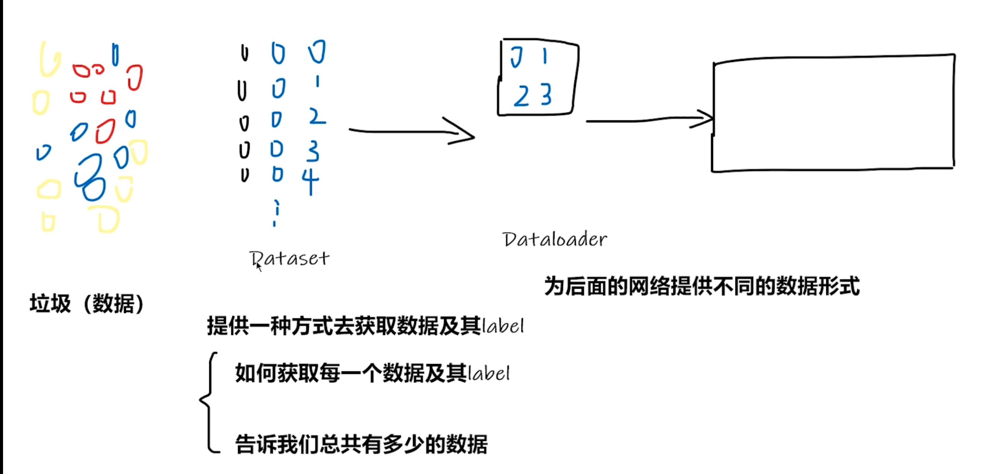


### 使用tensorboard

```python
from torch.utils.tensorboard import SummaryWriter
writer = SummaryWriter("logs")
# writer.add_image
for i in range(100):
    writer.add_scalar("y=x", i, i)
    writer.add_scalar("y=2x", 2*i, i)
writer.close()
```

`tensorboard --logdir=logs 打开tensorboard`

后跟`--port=6007`，指定端口，不指定的话每个用户看到的端口是一样的

`logdir=事件文件所在文件夹名`


### add_image()

```python
from torch.utils.tensorboard import SummaryWriter
from PIL import Image
import numpy as np

writer = SummaryWriter("logs")
image_path = "D:\Python\项目\learn-pytorch\img1.jpg"
img_PIL = Image.open(image_path)
img_array = np.array(img_PIL)
print(type(img_array))
print(img_array.shape)
# 从PIL到numpy,需要在add_image（）中指定shape中每一个数字/维表示的含义
writer.add_image("test", img_array, 1, dataformats='HWC')

writer.close()
```

### transfroms

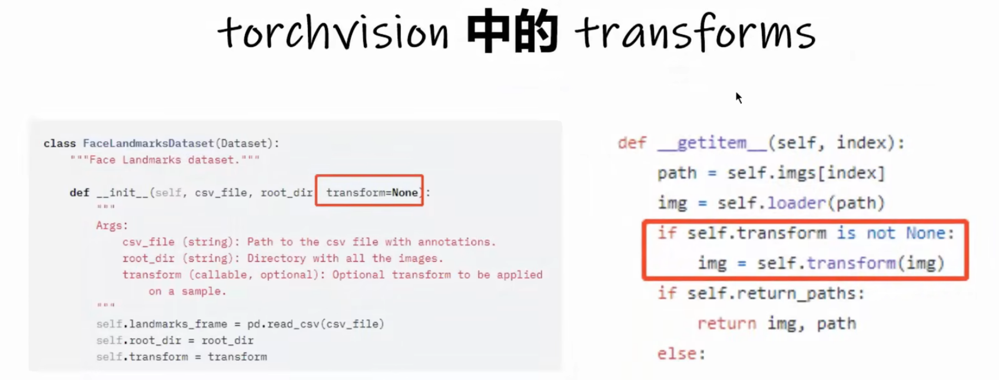

可以将PIL Image 或者 numpy.ndarray转换为tensor类型

```python
from torch.utils.tensorboard import SummaryWriter
from PIL import Image
import numpy as np
from torchvision import transforms

writer = SummaryWriter("logs")
image_path = "img1.jpg"
img = Image.open(image_path)

# transfrom.ToTenser()使用方法
tensor_trans = transforms.ToTensor()
tensor_img = tensor_trans(img)
writer.add_image("Tensor_img", tensor_img)

# Normalize
trans_norm = transforms.Normalize([1, 2, 3], [3, 2, 1])
img_norm = trans_norm(tensor_img)
writer.add_image("Normalize", img_norm)

writer.close()
```

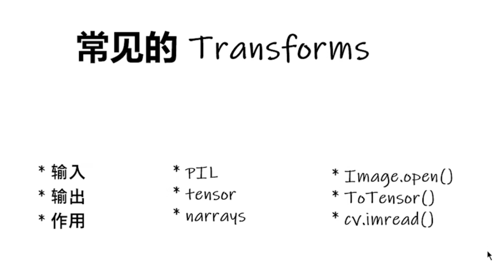

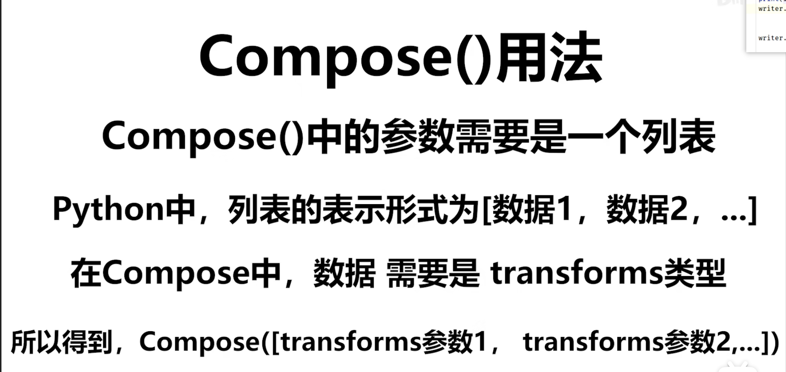

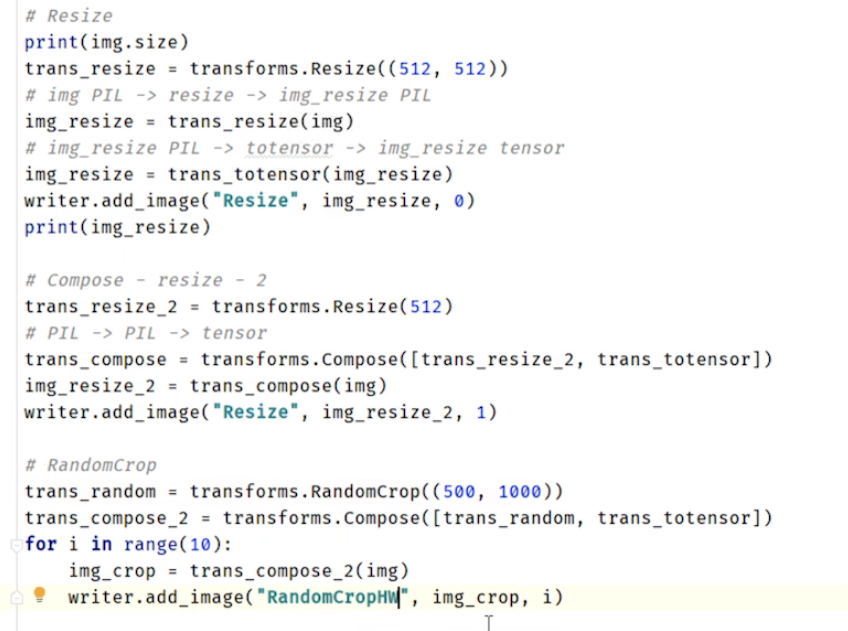

### torchvision中的数据集使用

```python
import torchvision
from torch.utils.tensorboard import SummaryWriter

dataset_transform = torchvision.transforms.Compose([
    torchvision.transforms.ToTensor()
])
# 从官网下载数据集，CTRL+p查看具体用法
train_set = torchvision.datasets.CIFAR10(root="./dataset", train=True, transform=dataset_transform, download=True)
test_set = torchvision.datasets.CIFAR10(root="./dataset", train=False, transform=dataset_transform, download=True)

print(test_set[0])
print(test_set.classes)

img, target = test_set[0]
print(img)
print(target)
print(test_set.classes[target])

writer = SummaryWriter("p10")
for i in range(10):
    img, target = test_set[i]
    writer.add_image("test_set", img, i)
writer.close()
```

Dataloader使用

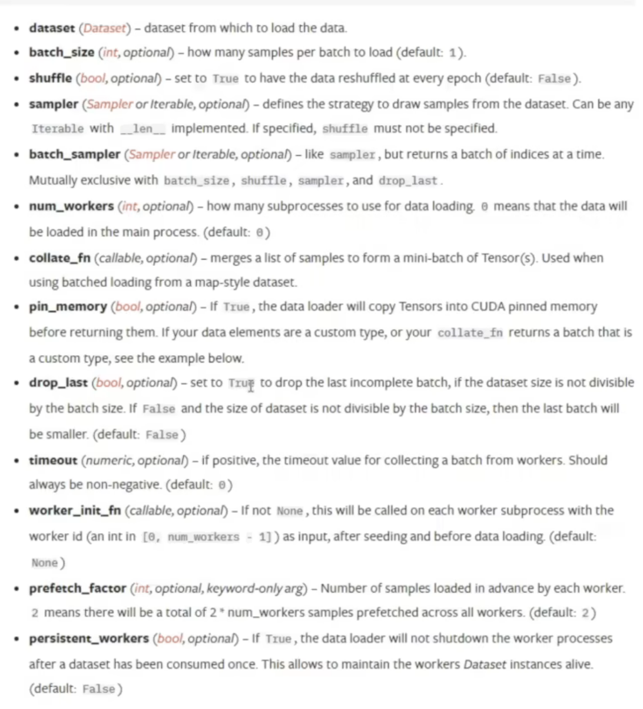

```python
import torchvision
# 准备的测试数据集
from torch.utils.data import DataLoader
from torch.utils.tensorboard import SummaryWriter

# 从官网下载数据集，CTRL+p查看具体用法train_set = torchvision.datasets.CIFAR10(root="./dataset", train=True,
# transform=torchvision.transforms.ToTensor())
test_data = torchvision.datasets.CIFAR10(root="./dataset", train=False, transform=torchvision.transforms.ToTensor())
test_loader = DataLoader(dataset=test_data, batch_size=64, shuffle=True, num_workers=0, drop_last=False)

# 测试数据集中的第一张图片及target
img, target = test_data[0]
print(img.shape)
print(target)

writer = SummaryWriter("dataloader")

step = 0
# 设置迭代次数，shuffle设置为true，则每次迭代加载的数据都是随机的，不一样
for epcho in range(2):
    for data in test_loader:
        imgs, targets = data
        print(imgs.shape)
        print(targets)
        writer.add_images("Epcho:{}".format(epcho), imgs, step)
        step = step + 1
writer.close()
```

### Module

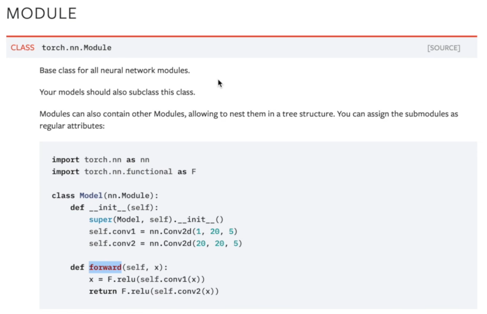

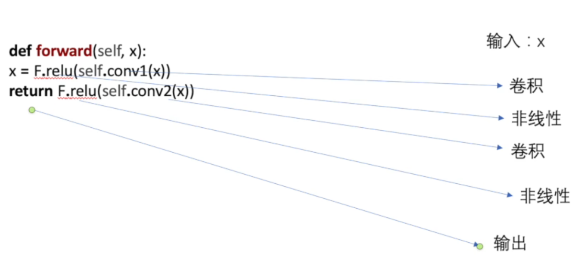

forward()应该在每次创建子类时重写


这里面conv2d(N,C,H,W)里面的四个是 N就是batch size也就是输入图片的数量，C就是通道数这只是一个二维张量所以通道为1，H就是高，W就是宽，所以是1 1 5 5

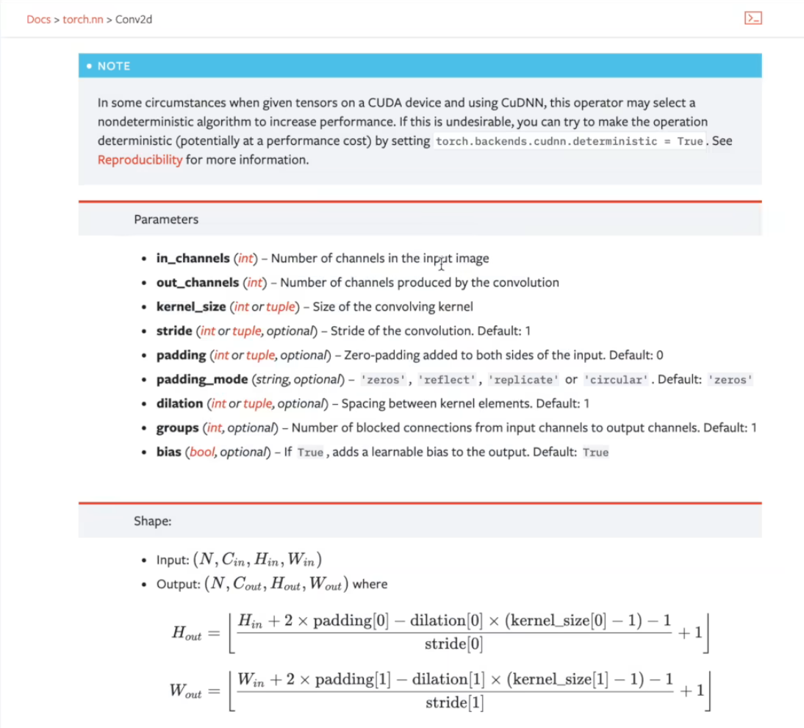

```python
class Tudui(nn.Module):
    def __init__(self):
        super(Tudui, self).__init__()
        self.conv1 = Conv2d(in_channels=3, out_channels=6, kernel_size=3, stride=1, padding=0)

    def forward(self, x):
        x = self.conv1(x)
        return x


tudui = Tudui()

writer = SummaryWriter("./logs")

step = 0
for data in test_loader:
    imgs, target = data
    output = tudui(imgs)
    print(imgs.shape)
    # torch.size([64,3,32,32])
    writer.add_images("input", imgs, step)
    print(output.shape)
    # torch.size([64,6,30,30])->torch.size([xxx,3,30,30])
    # 因为writer不能把六通道的数据显示出来，所以要把六通道的先转换为三通道的
    output = torch.reshape(output, (-1, 3, 30, 30))  # -1 表示系统会自动选择合适的size
    writer.add_images("output", output, step)
    step = step+1

writer.close()
```

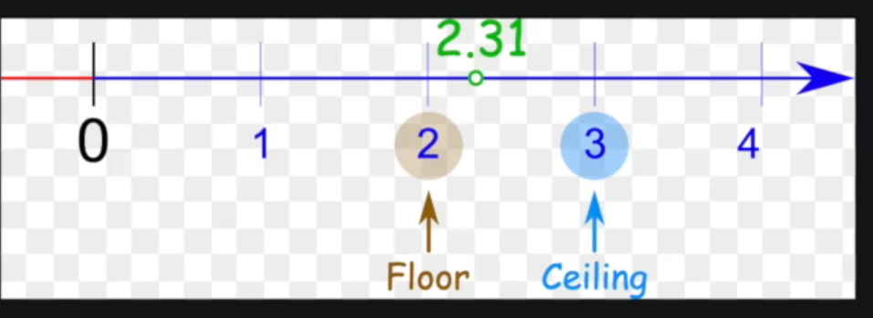

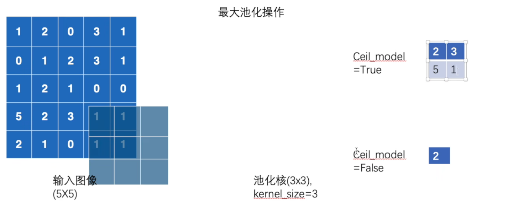

当覆盖区域小于池化核尺寸时，

ceil_model:保留数据

floor_model:不保留数据


常用的池化操作：最大池化

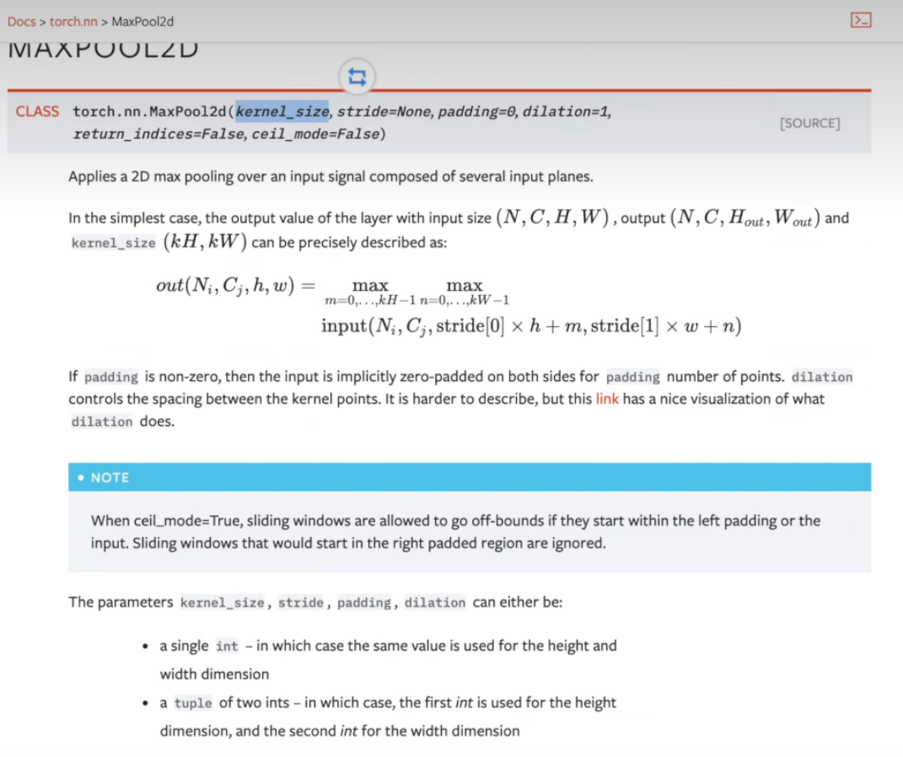

```python
input = torch.tensor([[1, 2, 3, 3, 1],
                      [0, 1, 2, 3, 1],
                      [1, 2, 1, 0, 0],
                      [5, 2, 3, 1, 1],
                      [2, 1, 0, 1, 1]], dtype=torch.float32)

input = torch.reshape(input, (-1, 1, 5, 5))
print(input.shape)


class Tudui(nn.Module):
    def __init__(self):
        super(Tudui, self).__init__()
        self.maxpool1 = MaxPool2d(kernel_size=3, ceil_mode=False)

    def forward(self, x):
        x = self.maxpool1(x)
        return x


tudui = Tudui()
output = tudui(input)
print(output)
```

```python
test_data = torchvision.datasets.CIFAR10(root="./dataset", train=False, transform=torchvision.transforms.ToTensor())
test_loader = DataLoader(dataset=test_data, batch_size=64)

class Tudui(nn.Module):
    def __init__(self):
        super(Tudui, self).__init__()
        self.maxpool1 = MaxPool2d(kernel_size=3, ceil_mode=False)

    def forward(self, x):
        x = self.maxpool1(x)
        return x


tudui = Tudui()

writer = SummaryWriter("./logs")

step = 0
for data in test_loader:
    imgs, target = data
    output = tudui(imgs)
    writer.add_images("input", imgs, step)
    writer.add_images("output", output, step)
    step = step + 1

writer.close()
```


激活函数ReLU

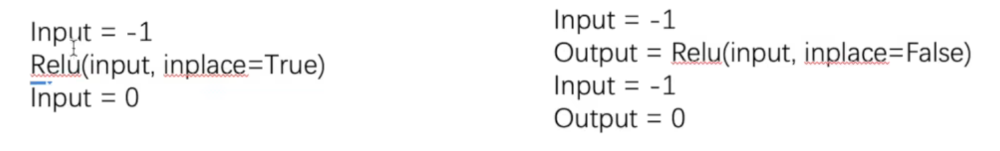


### cifar-10模型

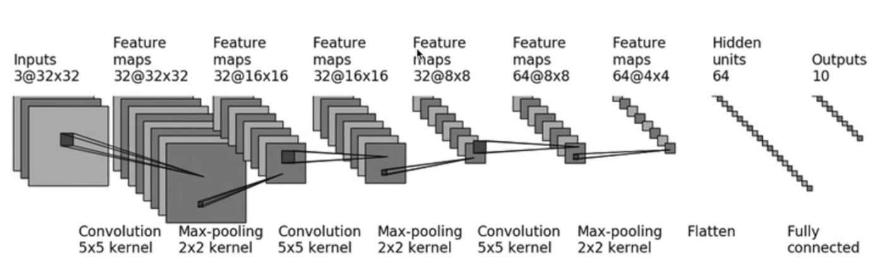

代码：

```python
import torch
from torch import nn
from torch.nn import Sequential, Conv2d, MaxPool2d, Flatten, Linear
from torch.utils.tensorboard import SummaryWriter


class Tudui(nn.Module):
    def __init__(self):
        super(Tudui, self).__init__()
        self.model1 = Sequential(
            Conv2d(3, 32, 5, padding=2),
            MaxPool2d(2),
            Conv2d(32, 32, 5, padding=2),
            MaxPool2d(2),
            Conv2d(32, 64, 5, padding=2),
            MaxPool2d(2),
            Flatten(),
            Linear(1024, 64),
            Linear(64, 10)
        )

    def forward(self, x):
        x = self.model1(x)
        return x


tudui = Tudui()
print(tudui)
input = torch.ones((64, 3, 32, 32))
output = tudui(input)
print(output.shape)

writer = SummaryWriter("./logs")
writer.add_graph(tudui, input)
writer.close()

```


### 常用的损失函数

```python
import torch
from torch import nn
from torch.nn import L1Loss

inputs = torch.tensor([1, 2, 3], dtype=torch.float32)
targets = torch.tensor([1, 2, 5], dtype=torch.float32)

inputs = torch.reshape(inputs, (1, 1, 1, 3))
targets = torch.reshape(targets, ([1, 1, 1, 3]))

# L1损失函数
loss = L1Loss(reduction='sum')
result = loss(inputs, targets)

# MSE损失函数
loss_me = nn.MSELoss()
result_me = loss_me(inputs, targets)

print(result)
print(result_me)

# CrossEntropyLoss交叉熵损失函数
x = torch.tensor([0.1, 0.2, 0.3])
y = torch.tensor([1])
x = torch.reshape(x, (1, 3))
loss_cross = nn.CrossEntropyLoss()
result_cross = loss_cross(x, y)
print(result_cross)
```


### 优化

optimization步骤：

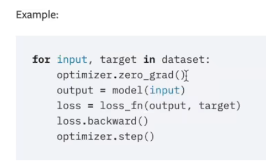

```python
import torch
import torchvision
from torch import nn
from torch.nn import Sequential, Conv2d, MaxPool2d, Flatten, Linear
from torch.utils.data import DataLoader
from torch.utils.tensorboard import SummaryWriter

test_data = torchvision.datasets.CIFAR10(root="./dataset", train=False, transform=torchvision.transforms.ToTensor())
test_loader = DataLoader(dataset=test_data, batch_size=64)


class Tudui(nn.Module):
    def __init__(self):
        super(Tudui, self).__init__()
        self.model1 = Sequential(
            Conv2d(3, 32, 5, padding=2),
            MaxPool2d(2),
            Conv2d(32, 32, 5, padding=2),
            MaxPool2d(2),
            Conv2d(32, 64, 5, padding=2),
            MaxPool2d(2),
            Flatten(),
            Linear(1024, 64),
            Linear(64, 10)
        )

    def forward(self, x):
        x = self.model1(x)
        return x


loss = nn.CrossEntropyLoss()
tudui = Tudui()
optim = torch.optim.SGD(tudui.parameters(), lr=0.01)
for epcho in range(20):
    running_loss = 0.0
    for data in test_loader:
        imgs, targets = data
        outputs = tudui(imgs)
        result_loss = loss(outputs, targets)
        # 特征优化
        optim.zero_grad()  # 每次先将梯度设为零
        result_loss.backward()  # 反向传播，更新梯度
        optim.step()  # 根据上面更新的梯度更新神经网络里的特征进行优化
        running_loss += result_loss
    print(running_loss)
```


### 现有网络模型的使用和修改

```python
import torchvision
from torch import nn

# 导入vgg16分类模型，参数为原始参数
vgg16_false = torchvision.models.vgg16(pretrained=False)
# 导入vgg16分类模型，参数为已经调试好的参数
vgg16_true = torchvision.models.vgg16(pretrained=True)

train_data = torchvision.datasets.CIFAR10("./dataset", train=True, transform=torchvision.transforms.ToTensor(),
                                          download=False)

# vgg16模型的最后输出分类是1000，因此调用模型后要修改模型，把最后的分类通道数改成适合的通道数
# 两种更改模型的方法
# 在模型分类器的最后添加一个线性函数
print(vgg16_true)
vgg16_true.classifier.add_module('add_linear', nn.Linear(1000, 10))
print(vgg16_true)

# 将模型分类器的最后的函数更改成输出为10个通道的线性函数
print(vgg16_false)
vgg16_false.classifier[6] = nn.Linear(4096, 10)
print(vgg16_false)
```


网络模型的保存与加载

```python
import torch
import torchvision

vgg16 = torchvision.models.vgg16(weights=None)

# 保存方式1，模型结构+模型参数
torch.save(vgg16, "vgg16_method1.pth")

# 保存方式2，模型参数（官方推荐，大小较小），以python字典的形式保存
torch.save(vgg16.state_dict(), "vgg16_method2.pth")
```

保存与加载在两个不同的python文件时，加载第二种方式的模型要麻烦一点

```python
import torch
import torchvision

# 加载下载好的模型
# 方式1
model1 = torch.load("vgg16_method1.pth")

# 方式2
vgg16 = torchvision.models.vgg16(weights=None)
vgg16.load_state_dict(torch.load("vgg16_method2.pth"))

print(model1)
print(vgg16)
```

但是在使用方式1（即保存模型结构+模型参数）保存自己写的模型时，在不同的文件中加载时要先引入

可以直接复制模型，也可以引用文件头 `from model_save import *`

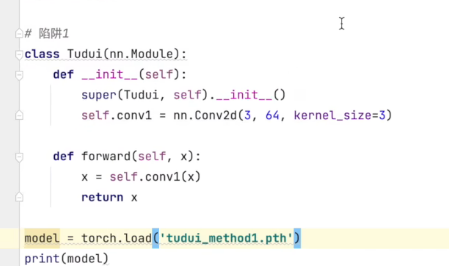


### 完整的模型训练套路

```python
import torchvision
from torch.utils.tensorboard import SummaryWriter

from model import *
# 准备数据集
from torch import nn
from torch.utils.data import DataLoader

train_data = torchvision.datasets.CIFAR10(root="./data", train=True, transform=torchvision.transforms.ToTensor(),
                                          download=True)
test_data = torchvision.datasets.CIFAR10(root="./data", train=False, transform=torchvision.transforms.ToTensor(),
                                         download=True)

# length 长度
train_data_size = len(train_data)
test_data_size = len(test_data)
# 如果train_data_size=10, 训练数据集的长度为：10
print("训练数据集的长度为：{}".format(train_data_size))
print("测试数据集的长度为：{}".format(test_data_size))


# 利用 DataLoader 来加载数据集
train_dataloader = DataLoader(train_data, batch_size=64)
test_dataloader = DataLoader(test_data, batch_size=64)

# 创建网络模型
tudui = Tudui()

# 损失函数
loss_fn = nn.CrossEntropyLoss()

# 优化器
# learning_rate = 0.01
# 1e-2=1 x (10)^(-2) = 1 /100 = 0.01
learning_rate = 1e-2
optimizer = torch.optim.SGD(tudui.parameters(), lr=learning_rate)

# 设置训练网络的一些参数
# 记录训练的次数
total_train_step = 0
# 记录测试的次数
total_test_step = 0
# 训练的轮数
epoch = 10

# 添加tensorboard
writer = SummaryWriter("./logs_train")

for i in range(epoch):
    print("-------第 {} 轮训练开始-------".format(i+1))

    # 训练步骤开始
    tudui.train()   # 模型进入train状态，对特定的几个函数起作用
    for data in train_dataloader:
        imgs, targets = data
        outputs = tudui(imgs)
        loss = loss_fn(outputs, targets)

        # 优化器优化模型
        optimizer.zero_grad()
        loss.backward()
        optimizer.step()

        total_train_step = total_train_step + 1
        if total_train_step % 100 == 0:
            print("训练次数：{}, Loss: {}".format(total_train_step, loss.item()))
            writer.add_scalar("train_loss", loss.item(), total_train_step)

    # 测试步骤开始
    tudui.eval()  # 模型进入eval状态，对特定的几个函数起作用
    total_test_loss = 0
    total_accuracy = 0
    with torch.no_grad():  # 设置梯度一直为0
        for data in test_dataloader:
            imgs, targets = data
            outputs = tudui(imgs)
            loss = loss_fn(outputs, targets)
            total_test_loss = total_test_loss + loss.item()
            accuracy = (outputs.argmax(1) == targets).sum()
            total_accuracy = total_accuracy + accuracy

    print("整体测试集上的Loss: {}".format(total_test_loss))
    print("整体测试集上的正确率: {}".format(total_accuracy/test_data_size))
    writer.add_scalar("test_loss", total_test_loss, total_test_step)
    writer.add_scalar("test_accuracy", total_accuracy/test_data_size, total_test_step)
    total_test_step = total_test_step + 1

    torch.save(tudui, "tudui_{}.pth".format(i))
    print("模型已保存")

writer.close()
```


可以分装成两个文件：

train.py

```python
import torch
import torchvision
from torch.utils.tensorboard import SummaryWriter

from model import *
# 准备数据集
from torch import nn
from torch.utils.data import DataLoader

train_data = torchvision.datasets.CIFAR10(root="./dataset", train=True, transform=torchvision.transforms.ToTensor(),
                                          download=True)
test_data = torchvision.datasets.CIFAR10(root="./dataset", train=False, transform=torchvision.transforms.ToTensor(),
                                         download=True)

# length 长度
train_data_size = len(train_data)
test_data_size = len(test_data)
# 如果train_data_size=10, 训练数据集的长度为：10
print("训练数据集的长度为：{}".format(train_data_size))
print("测试数据集的长度为：{}".format(test_data_size))


# 利用 DataLoader 来加载数据集
train_dataloader = DataLoader(train_data, batch_size=64)
test_dataloader = DataLoader(test_data, batch_size=64)

# 创建网络模型
tudui = Tudui()

# 损失函数
loss_fn = nn.CrossEntropyLoss()

# 优化器
# learning_rate = 0.01
# 1e-2=1 x (10)^(-2) = 1 /100 = 0.01
learning_rate = 1e-2
optimizer = torch.optim.SGD(tudui.parameters(), lr=learning_rate)

# 设置训练网络的一些参数
# 记录训练的次数
total_train_step = 0
# 记录测试的次数
total_test_step = 0
# 训练的轮数
epoch = 10

# 添加tensorboard
writer = SummaryWriter("./logs_train")

for i in range(epoch):
    print("-------第 {} 轮训练开始-------".format(i+1))

    # 训练步骤开始
    tudui.train()   # 模型进入train状态，对特定的几个函数起作用
    for data in train_dataloader:
        imgs, targets = data
        outputs = tudui(imgs)
        loss = loss_fn(outputs, targets)

        # 优化器优化模型
        optimizer.zero_grad()
        loss.backward()
        optimizer.step()

        total_train_step = total_train_step + 1
        if total_train_step % 100 == 0:
            print("训练次数：{}, Loss: {}".format(total_train_step, loss.item()))
            writer.add_scalar("train_loss", loss.item(), total_train_step)

    # 测试步骤开始
    tudui.eval()  # 模型进入eval状态，对特定的几个函数起作用
    total_test_loss = 0
    total_accuracy = 0
    with torch.no_grad():  # 设置梯度一直为0
        for data in test_dataloader:
            imgs, targets = data
            outputs = tudui(imgs)
            loss = loss_fn(outputs, targets)
            total_test_loss = total_test_loss + loss.item()
            accuracy = (outputs.argmax(1) == targets).sum()
            total_accuracy = total_accuracy + accuracy

    print("整体测试集上的Loss: {}".format(total_test_loss))
    print("整体测试集上的正确率: {}".format(total_accuracy/test_data_size))
    writer.add_scalar("test_loss", total_test_loss, total_test_step)
    writer.add_scalar("test_accuracy", total_accuracy/test_data_size, total_test_step)
    total_test_step = total_test_step + 1

    torch.save(tudui, "tudui_{}.pth".format(i))
    print("模型已保存")

writer.close()
```

model.py

```python
import torch
from torch import nn

# 搭建神经网络
class Tudui(nn.Module):
    def __init__(self):
        super(Tudui, self).__init__()
        self.model = nn.Sequential(
            nn.Conv2d(3, 32, 5, 1, 2),
            nn.MaxPool2d(2),
            nn.Conv2d(32, 32, 5, 1, 2),
            nn.MaxPool2d(2),
            nn.Conv2d(32, 64, 5, 1, 2),
            nn.MaxPool2d(2),
            nn.Flatten(),
            nn.Linear(64*4*4, 64),
            nn.Linear(64, 10)
        )

    def forward(self, x):
        x = self.model(x)
        return x


if __name__ == '__main__':
    tudui = Tudui()
    input = torch.ones((64, 3, 32, 32))
    output = tudui(input)
    print(output.shape)
```


### 使用GPU训练模型

方法一
在合适位置添加如下代码

```python
device = torch.device("cuda")
tudui = tudui.to(device)
loss_fn = loss_fn.to(device)
targets = targets.to(device)
outputs = tudui(imgs)
loss_fn = loss_fn.to(device)
```

方法二
将以上每一条代码改成

```python
if torch.cuda.is_available():
    tudui = tudui.cuda()
```

