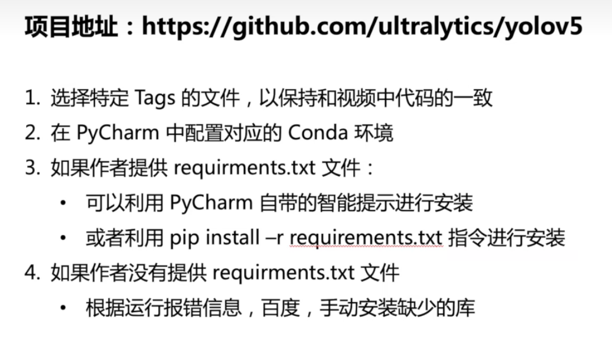

运行问题：

`AttributeError: 'FreeTypeFont' object has no attribute 'getsize'`

解决方法：

这是因为安装了新版本的 [Pillow](https://so.csdn.net/so/search?q=Pillow&spm=1001.2101.3001.7020) (10)，`pip install tf-models-official`删除了该`getsize `功能
，降级到 Pillow 9.5 解决了该问题

可以尝试以下方法进行解决：

```cobol
pip install Pillow==9.5
```


在谷歌的colab的云服务器上运行代码：

`!unzip /content/yolov5-7.0.zip -d /content/yolov5`

`%cd /content/yolov5/yolov5-7.0`

`!pip install -r requirements.txt`

`!python detect.py`

`%load_ext tensorboard`

`%tensorboard --logdir=runs/detect`